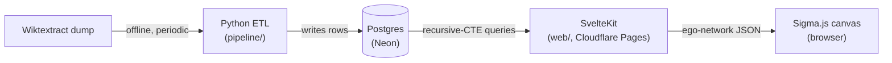

# CLAUDE.md

Guidance for Claude Code working in the **etymyriad** repository.

## What this is

etymyriad is an **etymology network visualizer**: explore the ancestry,
descendants, and cognates of words as an interactive graph, backed by a
**sourced, citable** dataset. The name is _etymology + myriad_ ("a myriad of
word origins").

Audience: a portfolio/learning showcase that doubles as a public tool for
language enthusiasts, held to research-grade accuracy.

Full rationale for every foundational decision is in
[`docs/DESIGN.md`](docs/DESIGN.md). Read it before proposing architectural
changes.

## Current status

Early scaffold. The foundation is poured and **verified** (pipeline tests pass,
web type-check and Cloudflare build are clean), but most feature logic is still
stubbed. The single most important unimplemented piece is
`pipeline/.../normalize._edges_from_entry` (see Open items).

## Architecture



Two languages, each where it is strongest, with Postgres as the clean boundary.
The pipeline is isolated: it runs offline and only writes rows, so it shares no
code with the app. The web app is **both** the frontend and the API (SvelteKit
`+server.ts` routes query Postgres directly, with no separate API service).

## Repo layout

| Path                                         | Purpose                                                            |
| -------------------------------------------- | ------------------------------------------------------------------ |
| `db/schema.sql`                              | Canonical Postgres schema. The source of truth for the data model. |
| `db/migrations/`                             | Ordered SQL migrations (baseline mirrors `schema.sql`).            |
| `pipeline/`                                  | Python ETL (uv, src layout). Parses Wiktextract into the graph.    |
| `pipeline/src/etymyriad/`                    | `parse` -> `normalize` -> `load`. `model` mirrors the SQL.         |
| `web/`                                       | SvelteKit app (frontend + API).                                    |
| `web/src/lib/types.ts`                       | Graph types shared by API and UI. Mirror of the schema.            |
| `web/src/lib/server/`                        | Server-only DB client and queries.                                 |
| `web/src/routes/api/word/[lang]/[headword]/` | Ego-network endpoint.                                              |
| `docs/DESIGN.md`                             | Foundation design doc (decisions + rationale).                     |

## Data model invariants (do not violate)

The model is a directed, provenance-carrying graph (`db/schema.sql`):

- **`lexeme`** = a node (a word/morpheme in one language).
- **`etymology`** = a directed edge, `src -> dst` meaning **ancestor ->
  descendant**.
- **Every edge carries a `source_ref`** back to its Wiktionary origin. Nothing
  in the graph is unsourced. This is what makes the dataset citable.
- **Never generate etymological facts with AI.** The graph is deterministic and
  sourced. AI (deferred) may later summarize or search over it, never author it.
- **Never render the whole graph.** Every view is a depth-limited **ego-network**
  (the anti-noise primitive). The browser only ever sees a focused slice.
- Edge direction matters: backtrace walks `dst -> src`, and descendants walk
  `src -> dst`. Traversals use Postgres recursive CTEs.

If you change `db/schema.sql`, update both `pipeline/.../model.py` and
`web/src/lib/types.ts` to match.

## Tech stack and locked decisions

Do not relitigate these without a reason. They were chosen deliberately.

| Area         | Choice                       | Why                                                        |
| ------------ | ---------------------------- | ---------------------------------------------------------- |
| v1 scope     | Indo-European family         | Best Wiktionary coverage, richest chains.                  |
| Data source  | Wiktextract / kaikki.org     | Machine-readable, cited. Validate vs Etymological Wordnet. |
| Pipeline     | Python 3.13 (uv)             | Wiktextract is Python. Best data/NLP ecosystem.            |
| DB           | Postgres on **Neon**         | Recursive CTEs for traversal, serverless free tier.        |
| App + API    | **SvelteKit** (TypeScript)   | One codebase, shared types. Server routes are the API.     |
| Graph render | **Sigma.js v3 + graphology** | WebGL, scales to 10k+ nodes.                               |
| Hosting      | **Cloudflare Pages** + Neon  | `adapter-cloudflare`. Routes run as Pages Functions.       |
| Domain       | etymyriad.com                | Matches repo = package = domain.                           |
| AI           | Deferred                     | Designed-for, not built.                                   |

## Conventions

Python is uv-managed with **ruff** (`ruff format`, `ruff check`) at 80 cols,
src layout. Keep pipeline dependencies minimal and justify each
addition in the PR. Before committing pipeline changes, run
`uv run ruff format && uv run ruff check && uv run ty check && uv run pytest`
(or `make lint ty test`). TypeScript/Svelte
uses 2-space indentation and must keep `svelte-check` clean, with server-only
code confined to `lib/server/`. The Google Python and TypeScript style guides
are the definitive baselines.

**Commits:** Conventional Commits. End commit messages with the
`Co-Authored-By` trailer. Branch off the default branch for feature work.

**General** (from the user's global CLAUDE.md): concise explanations, prefer
composition over inheritance, show the verify command for changes.

**Development discipline (TDD):** All feature work and bugfixes in this repo go
through test-driven development. Write the failing test first, watch it fail for
the right reason, then write the minimal code to pass, then refactor. The Iron
Law holds: no production code without a failing test first. Code written before
its test gets deleted and rewritten from the test, not adapted in place. This
covers the pipeline (`uv run pytest`) and the web app (`npm run check` plus
vitest); a `svelte-check` error counts as a failing test. Narrow exceptions
(throwaway spikes, generated code, pure config) need a heads-up first, never a
silent skip. A golden-test divergence is a parser bug: fix the parser, never
edit the golden value to match buggy output.

## Common commands

```sh
# Database (local dev, via podman)
make db-up         # start local Postgres
make db-init       # apply db/schema.sql
make db-psql       # psql shell
make db-reset      # wipe + re-init

# Pipeline (Python)
cd pipeline && uv sync
uv run pytest
uv run ruff check        # lint
uv run ruff format       # format
uv run ty check          # type-check
uv run etymyriad parse   # inspect the dump
uv run etymyriad all     # parse + normalize + load

# Web (frontend + API)
cd web && npm install
npm run dev        # local dev server
npm run check      # svelte-check (must be clean)
npm run build      # production build via Cloudflare adapter
```

## Local-dev gotchas

- **System Python is 3.14**, too new for some data-lib wheels. The pipeline is
  pinned to **3.13** via `pipeline/.python-version`, and uv fetches it
  automatically.
  Do not "upgrade" this without checking wheel availability.
- **The Neon serverless driver talks HTTP to Neon, not to local Postgres.** So:
  local **podman** Postgres is for the pipeline's bulk-load iteration and
  `psql`. Point the **web app's `DATABASE_URL` at a Neon branch** for web dev.
  (If we ever want fully-local web dev, add Neon's local serverless proxy.)
- `DATABASE_URL` and `WIKTEXTRACT_DUMP` come from `.env` (see `.env.example`).
  `.env` is gitignored.
- The Neon client is created **lazily** (`web/src/lib/server/db.ts`) so the
  build does not require `DATABASE_URL`. Keep it lazy.

## Open items / yet-to-be-determined

Implementation, roughly in order:

1. **`normalize._edges_from_entry`** (the core TODO): parse each entry's
   `etymology_templates` into `EtymEdge`s using `TEMPLATE_RELS`. Validate output
   against the Etymological Wordnet before trusting it.
2. **Seed the `language` table** with real names/families (the loader currently
   inserts bare code-only rows).
3. **Acquire data:** `data/raw/` (gitignored) already has
   `proto-germanic.jsonl` and `proto-indo-european.jsonl` from kaikki.org.
   Pull the rest of the Indo-European subset, then reconcile the per-family
   files with `.env.example`'s single `WIKTEXTRACT_DUMP` path.
4. **Frontend graph view:** wire the landing-page search to a Sigma.js canvas
   backed by `/api/word/:lang/:headword`. Implement the anti-noise UX
   (click-to-expand, rel-type/language filters, level-of-detail).
5. **Backtrace endpoint + view:** linear ancestor chain for any word.

Done: GitHub repo is public
(`github.com/van-riper/etymyriad`), **etymyriad.com** is registered and live
via a Cloudflare Pages project auto-deploying on push to `main`, and CI is
green.

Accounts / infra still to set up (by the user):

- Neon account + project, with `DATABASE_URL` wired as a local `.env` entry
  for the pipeline and (once a route needs it) a Cloudflare Pages secret.

Decisions still open:

- Whether to add a migration runner (dbmate/atlas) once the schema churns.
  Plain ordered SQL for now.
- Homograph handling: lexeme natural key is
  `(lang_code, headword, COALESCE(gloss, ''))`. Revisit if sense disambiguation
  needs `pos` too.
- Whether/when to enable AI features (NL search, prose summaries).

Future feature specs (each a read over the same schema, own design doc):
individual word breakdown pages (SEO/SSG), word -> country/region map, cognate
explorer.

## References

- `docs/DESIGN.md`: foundation design and rationale.
- Wiktextract / kaikki.org: https://kaikki.org
- Etymological Wordnet: validation source.
