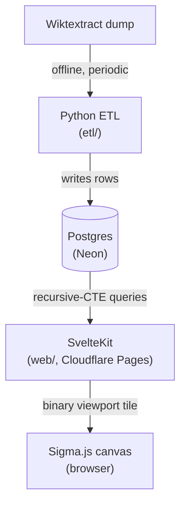

# Etymyriad

An etymology network visualizer: explore the ancestry, descendants, and cognates
of words as an interactive graph, backed by a sourced, citable dataset.

> _etymology + myriad_: a myriad of word origins.

## Status

The data pipeline is proven: the full Indo-European Wiktextract dataset is
acquired and a real 2.99M-edge graph loads and backtraces correctly locally,
with a precomputed force-directed layout for every lexeme. The frontend
renders a server-positioned Sigma.js graph view (search, click-to-navigate,
hover/click for lazy word detail, a random-word button) as a bounded
viewport tile around the focus word, so dense words no longer render as an
unreadable tangle. Full anti-noise UX (a min-degree filter, clustering) is
still ahead. See [`docs/DESIGN.md`](docs/DESIGN.md) for the foundation.
v1 targets the **Indo-European** family.

## Architecture



- **`etl/`**: Python ETL (Extract, Transform, Load) that parses
  [Wiktextract](https://kaikki.org) data into a normalized etymology graph
  and loads it into Postgres.
- **`db/`**: the canonical Postgres schema and migrations (source of truth
  shared by the ETL and the web app).
- **`web/`**: a SvelteKit app that is both the frontend and the API. Server
  routes query Postgres directly. The browser renders the graph with Sigma.js.

Two languages, each where it is strongest, with Postgres as the clean boundary.

## Development

Prerequisites: Node 22+, uv, podman (or docker), git.

```sh
# 1. Start a local Postgres and apply the schema
make db-up
make db-init

# 2. ETL (Python 3.13, managed by uv)
cd etl && uv sync

# 3. Web app (frontend + API)
cd web && npm install && npm run dev
```

See the `Makefile` for all targets.

### Bumping the version

Edit the `version` key in both `etl/pyproject.toml` and
`web/package.json`, then run:

```sh
make etl-sync && make web-install
```

This refreshes `etl/uv.lock` and `web/package-lock.json` to match.

## Licensing

etymyriad carries two licenses: one for the code, one for the data.

- **Source code** (`etl/`, `web/`, `db/`): **MIT**, see [`LICENSE`](LICENSE).
- **Derived etymology dataset**: **CC BY-SA 4.0**, inherited from its sources.
  (see below)

### Data sources and attribution

The dataset is built from:

- **Wiktionary**: the underlying lexical and etymological content,
  dual-licensed under
  [CC BY-SA 4.0](https://creativecommons.org/licenses/by-sa/4.0/) and the GFDL.
- **Wiktextract / kaikki.org** (Tatu Ylönen): a machine-readable extraction of
  Wiktionary, distributed under the same terms.
- **Etymological Wordnet** (Gerard de Melo): used only to validate the parser,
  derived from Wiktionary, CC BY-SA 3.0.

Because the dataset is a derivative of Wiktionary, any redistribution of the
data (a database dump, an export endpoint) must:

1. **Attribute** Wiktionary and its contributors.
2. **Share alike**: license the redistributed data under CC BY-SA 4.0.
3. **Indicate changes** made during normalization.

The interactive site satisfies attribution by linking each etymological edge
back to its Wiktionary source page. Provenance is stored per edge in the
`etymology.source_ref` column.

### UI theme

The site's light/dark color palette is
[Flexoki](https://github.com/kepano/flexoki) by Steph Ango.
