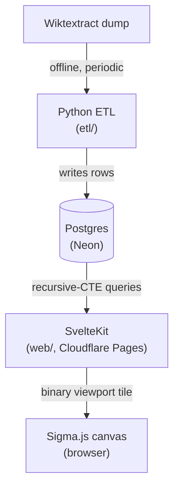
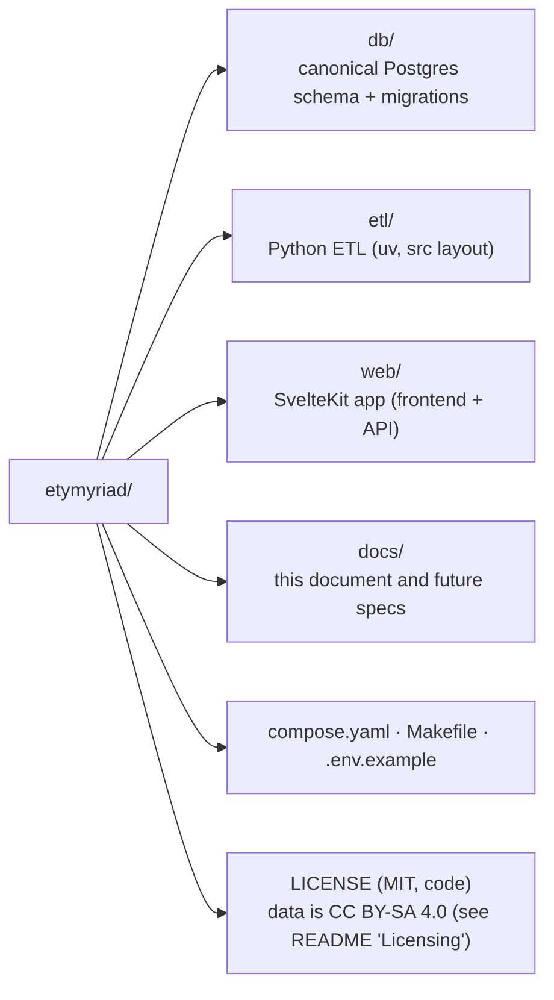

# Etymyriad: Foundation Design

_Last updated: 2026-07-21_

This document records the foundational, hard-to-reverse decisions for the
project. Feature-level designs (graph UI, country map, backtraces) are separate
follow-on specs. This is only the bedrock.

## 1. Purpose

An etymology **network visualizer**: explore the ancestry, descendants, and
cognates of words as an interactive graph, backed by a **sourced, citable**
dataset. Audience is a mix of a portfolio/learning showcase and a public tool
for language enthusiasts, with research-grade accuracy as a guiding constraint.

## 2. Guiding principle

The one genuinely irreversible asset is the **data model + ingestion pipeline**.
Everything downstream (database host, API, frontend, AI) plugs into a stable
data layer and can be swapped. So the schema is designed to be storage-agnostic
and provenance-first, and protected accordingly.

## 3. Scope (v1)

- **Indo-European** language family. Best Wiktionary coverage, richest cognate
  and backtrace chains, largest audience. Expand to other families later.
- No AI in v1 (see §9).

## 4. Architecture

Two languages, each where it is strongest, with Postgres as the clean boundary:

- **ETL, Python.** Wiktextract is a Python project, and the data-wrangling
  and future NLP/AI ecosystem is Python-first. The ETL is isolated: it runs
  offline and only writes rows, so it shares no code with the app.
- **API + Frontend, TypeScript / SvelteKit.** One codebase for the product,
  with types shared between server routes and UI. SvelteKit's server routes
  _are_ the API (no separate service), querying Postgres directly.

## 5. Data sources

- **Wiktextract / kaikki.org** (Tatu Ylönen): primary. Machine-readable JSON of
  Wiktionary with `etymology_templates`, `descendants`, and citations.
- **Etymological Wordnet** (de Melo): used only to validate the parser.
- The project builds its **own normalized database**. It never queries
  Wiktionary live.

## 6. Data model

See `db/schema.sql` for the authoritative DDL. Summary:

- **`lexeme`** (node): a word/morpheme in one language. Carries `lang_code`,
  `headword`, optional `gloss`/`pos`/`romanization`, `is_reconstructed` (for
  proto-forms), and a `source_ref`.
- **`etymology`** (edge): a directed, typed relation `src → dst` (ancestor →
  descendant), with a `rel_type` enum mirroring Wiktionary's relations
  (inherited, borrowed, derived, root, affix, calque, cognate, …) and a
  per-edge `source_ref` citation.
- **Traversals**: linear backtrace (ancestors) uses a Postgres recursive
  CTE (not yet built as an app feature -- see `db/schema.sql`'s reference
  queries). The graph view instead reads a precomputed spatial layout
  (`lexeme_layout`: DrL force-directed positions computed offline, see
  §7) via a bounding-box + proximity-ordered query, capped at a fixed
  node count. Trigram index for search.

## 7. Anti-noise principle

Never render the whole graph. Every view is a **viewport tile**: resolve a
word to a precomputed `(x, y)` position (a DrL force-directed layout,
computed once offline over the whole graph and stored in
`lexeme_layout`), fetch a bounded slice around it, and render it with
server-supplied positions -- no client-side layout math. The full graph
stays in Postgres, and the browser only ever sees a focused slice.

This started as a graph-traversal design (BFS neighbors to depth N), but
that approach was replaced (ETYM-67/69/70/71): a recursive-CTE
neighborhood search doesn't bound render cost on its own, and separately,
this dataset's DrL coordinates are dense enough that even a small
bounding box can contain hundreds of thousands of nodes near the
center. The shipped mechanism instead caps the query itself: a fixed
node-count limit, ordered by proximity to the box's center so the
focus word always appears regardless of its own connectivity. Filtering
by `rel_type`/language, clustering distant nodes with level-of-detail,
and live pan/zoom-triggered refetching remain future anti-noise UX work.
Rendering: **Sigma.js v3 + graphology** (WebGL, scales to 10k+ nodes).

## 8. Hosting

| Concern              | Choice                                                       |
| -------------------- | ------------------------------------------------------------ |
| Database             | **Neon** (serverless Postgres, pay-as-you-go)                |
| App (frontend + API) | **Cloudflare Pages** (SvelteKit via `adapter-cloudflare`)    |
| Domain               | **etymyriad.com**, registered at Cloudflare or Porkbun       |
| Local dev DB         | Postgres in a **podman** container (`compose.yaml`)          |

Roughly $0/month until real traffic, then a few dollars. The domain fronts
everything and is portable, so none of this is locked in.

## 9. AI (deferred)

Designed-for, not built. Because the data is structured and sourced, AI can
later be added for natural-language search and prose summaries **without**
touching the graph. The graph itself stays deterministic and citable. AI never
generates etymological facts.

## 10. Roadmap (follow-on specs)

Each becomes a read over the same schema:

- Individual word breakdown pages (SEO-friendly, statically generated).
- Linear backtrace view for any word in any language.
- Word → country/region map (geography of origins).
- Cognate explorer, filters, search.

## 11. Repo layout

