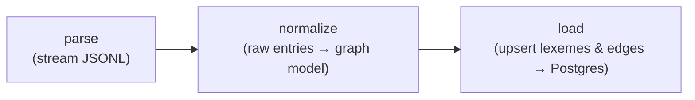

# etymyriad (etl)

The offline ETL that turns Wiktextract data into the etymology graph.



## Usage

```sh
uv sync                     # install (fetches Python 3.13)
cp ../.env.example ../.env  # set DATABASE_URL and WIKTEXTRACT_DUMP

# One-time: kaikki.org only distributes one combined dump (every language
# mixed together). Filter it down to Indo-European first:
uv run etymyriad filter-ine --input raw-wiktextract-data.jsonl.gz \
                             --output ../data/raw/indo-european.jsonl

uv run etymyriad all        # parse + normalize + load
uv run etymyriad parse      # parse only (inspect intermediate output)
uv run pytest               # tests
```

## Modules

| Module          | Responsibility                                             |
| --------------- | ----------------------------------------------------------- |
| `parse.py`      | Stream a (optionally gzipped) Wiktextract JSONL dump into raw entry dicts. |
| `languages.py`  | The Indo-European language name list and dump filter (`filter_indo_european`). |
| `normalize.py`  | Map raw entries to `Lexeme` / `EtymEdge` graph objects.    |
| `edgefile.py`   | Serialize/deserialize `EtymEdge`s to the JSONL intermediate between `normalize` and `load`. |
| `load.py`       | Upsert the graph into Postgres (idempotent, chunked).      |
| `model.py`      | The `Lexeme`, `EtymEdge`, and `RelType` definitions.       |
| `config.py`     | Environment-driven configuration.                          |
| `__main__.py`   | The `etymyriad` CLI (`filter-ine`, `parse`, `normalize`, `load`, `all`). |

The graph model in `model.py` mirrors `db/schema.sql` exactly.
