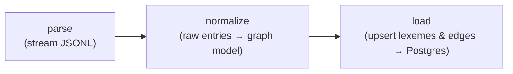

# etymyriad (etl)

The offline ETL that turns Wiktextract data into the etymology graph.



## Usage

```sh
uv sync                     # install (fetches Python 3.13)
cp ../.env.example ../.env  # set DATABASE_URL and WIKTEXTRACT_DUMP

uv run etymyriad all        # parse + normalize + load
uv run etymyriad parse      # parse only (inspect intermediate output)
uv run pytest               # tests
```

## Modules

| Module         | Responsibility                                          |
| -------------- | ------------------------------------------------------- |
| `parse.py`     | Stream the Wiktextract JSONL dump into raw entry dicts. |
| `normalize.py` | Map raw entries to `Lexeme` / `EtymEdge` graph objects. |
| `load.py`      | Upsert the graph into Postgres (idempotent).            |
| `model.py`     | The `Lexeme`, `EtymEdge`, and `RelType` definitions.    |
| `config.py`    | Environment-driven configuration.                       |

The graph model in `model.py` mirrors `db/schema.sql` exactly.
